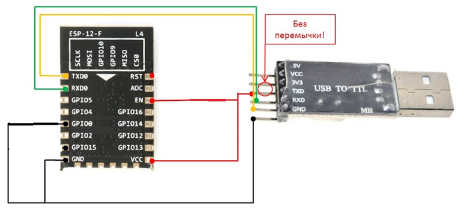
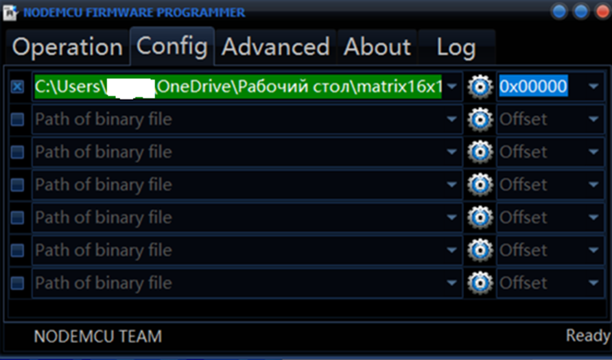
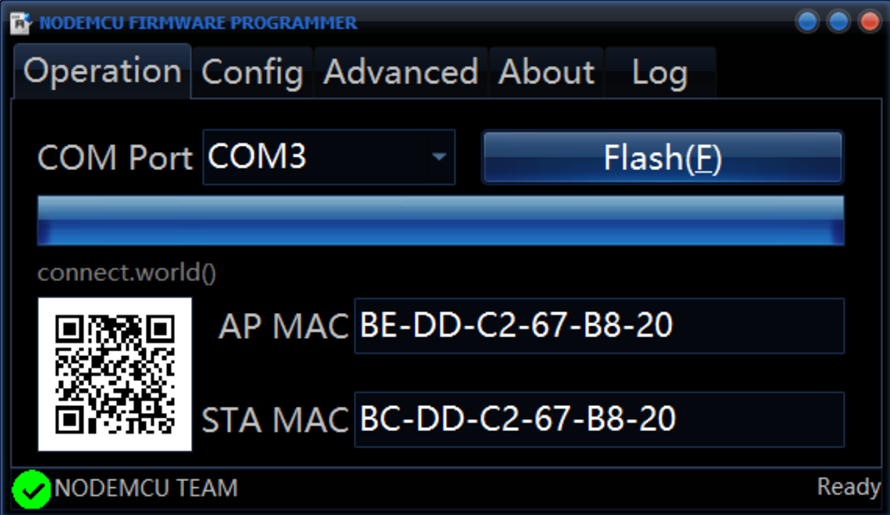

**Новогодняя гирлянда**
=====================

**The christmas lights**
=====================

<p align="center">
  
</p>

`Описание проекта`
-----------------------------------

**Это моя попытка создать новогоднюю оконную гирлянду, на основе светодиодов WS2812B, управляемых с помощью приложения для операционной системы Android (телефоны, планшеты и декстопы).**

**некоторые эффекты для гирлянды были разработаны мной полностью, а также некоторые вдохновлены и/или взяты с модификацией из следующих источников:**

* Проекты alexgyver.ru;
* Проекты wokwi.com;
* Примеры из библиотек Adafruit NeoPixel, Adafruit NeoMatrix и FastLED;
* Проекты других авторов, чьи данные, к сожалению, не сохранились.

**Вы можете повторить мой проект и собрать свою собственную новогоднюю гирлянду. 
Андроид приложение ([скачать из RuStore](https://www.rustore.ru/catalog/app/BARANOV.K.D.LED_Girlianda)) предназначено для управления по сети WI-FI микроконтроллером ESP8266, который в свою очередь управляет новогодней гирляндой (матрицей и зсветодиодов) . Доступно 56 различных эффектов, включая красочные радужные переливы, бегущую строку, анимацию и многое другое. ВНИМАНИЕ: некоторые эффекты запускаются и отключаются с задержкой от 1 до 5 секунд, во избежание зависания не нужно много раз нажимать на включение или отключение режима но если прошло более 10 секунд то это неисправность.**

**Гирлянда в виде матрицы из 12х13 светодиодов идеально подойдёт для большинства двустворчатых окон с размером оконного проема 150х150 см (обычно как раз 120 мм в ширину и 130 мм в высоту занимает стклопакет). Если у вас окно другого размера или вы хотите повесить гирлянду на балкон, вы можете изменить размеры матрицы в исходном коде в соответствии с вашими потребностями.**

<p align="center">
  
</p>

`Прошивка микроконтроллера ESP`
-----------------------------------

Для начала необходимо прошить модуль ***ESP-12E/12F*** или отладочную плату на его основе ***NodeMCU***.
1.	По ссылке или из репозитория скачайте [***ESP8266Flasher***](https://github.com/ThyingEquation/The-WI-FI-LIGHTS/blob/main/ESP8266Flasher.exe) и скачайте файл прошивки ***.bin*** для матрицы [12х13, текст внутри](https://github.com/ThyingEquation/The-WI-FI-LIGHTS/blob/main/Firmware/12x13%20text%20inside.bin), [12х13, текст снаружи](https://github.com/ThyingEquation/The-WI-FI-LIGHTS/blob/main/Firmware/12x13%20text%20outside.bin). Матрица 12х13 подойдет для стандартных двустворчатых окон, при расположении начала ленты в правом нижнем углу и с последующим движением ленты вверх, текст будет выводиться в зависимости от выбранной прошивки. Внутри: для чтения из помещения; снаружи: отраженный для чтения с улиы. 
2. Соберите схему, изображенную ниже, для прошивки модуля ***ESP-12E/12F*** через переходник ***UART -> USB***  или просто подключите через ***USB*** к ***ПК*** отладочную плату ***NodeMCU***.

<p align="center">

</p>

3. Запустите ***ESP8266Flasher*** и во вкладке ***config*** в первой строке выберите файл прошивки ***.bin***, вернитесь на вкладку ***operation*** и нажмите кнопку ***flash*** и дождитесь прошивки. 

<p align="center">

</p>

Если все прошло удачно, программа уведомит Вас в левом нижнем углу о удачной прошивке.

<p align="center">

</p>

4. После прошивки необходимо перезагрузить модуль ***ESP-12E/12F*** или нажать на кнопку ***RST*** на отлажочной плате ***NodeMCU***.
 
`Сборка схемы`
-----------------------------------
    
   Соберите [схему](https://github.com/ThyingEquation/The-WI-FI-LIGHTS/blob/main/Гирлянада-Э3.jpg) на основе отладочной платы NodeMCU или [схему](https://github.com/ThyingEquation/The-WI-FI-LIGHTS/blob/main/Гирлянада_ESP12EF.pdf) на основе модуля ***ESP-12E/12F***. Для схемы на основе модуля ***ESP-12E/12F*** возможно изготовить [печатную плату](https://github.com/ThyingEquation/The-WI-FI-LIGHTS/blob/main/LUT_board.pdf). Плата специально изготавливалась под ЛУТ для одностороннего стеклотекстолита. ВАЖНО! Прошивать модуль можно и в собранной схеме
   
   Техничческие параметры схемы: 
   + напряжение питания 5 В от блока питания (220 В -> 5 В);
   + ток потребления схемы (матрица отключена, только отладочная плата NodeMCU) 0,250 А;
   + ток потребления 156 (12х13) светодиодов белого цвета (самый прожорливый цвет) при обычной яркости (50 из 255 возможных, в прошивке в качестве стандартной) + схема в сборе ≈ 1,110 А;
   + ток потребления 156 (12х13) светодиодов белого цвета при максимальной яркости (255) + схема в сборе ≈ 2,5 А;
     
```diff
-ВНИМАНИЕ!!! Увеличение яркости более 50 значительно увеличивает потребление тока и нагрев светодиодов!!!
```

`Подключение и работа`
-----------------------------------
    
   Скачайте и установите из RuStore [приложение](https://apps.rustore.ru/app/BARANOV.K.D.LED_Girlianda). При первом запуске приложения, необходимо обязательно настроить имя сети WI-FI во вкладке "НАСТРОЙКИ" (изначально сеть будет называться по типу `ESP-67B17`). После смены имени сети на ваше, сеть с новым именем теперь будет запрашивать пароль, который равен `11111111` (8 единиц). Настройка завершена. 
   Возможны зависания (по сети Wi-Fi подключается, но на команды не реагирует), в случае зависания просто перезагрузить. Если гирлянда работала но потом перестала работать, проверьте, есть ли сеть Wi-Fi создаваемая гирляндой, если сеть есть и возможно подключиться, то произошла утечка памяти и контроллер сам перезагрузился (при условии, если не выбран стартовый режим, если режим выбран то после перезагрузки запустится стартовый режим и вы не заметите произошедшей утечки). Утечка памяти мной отлавливается и предположительно возникает из-за работы двух библиотек ESP8266WiFi и Adafruit_NeoMatrix, для версии гирлянды 3.1 данная проблема не устранена, но возникает на много реже чем было в ранних версиях. Она выявлена на некоторых анимациях и режиме "Метеорный поток". Остальные возникшие проблемы могут быть связаны с некорректной сборкой самой схемы. 
   Не оставляйте гирлянду без присмотра, отключайте на ночь.
