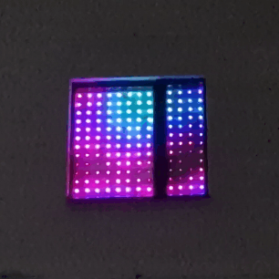

❖ Новогодняя гирлянда - The Christmas lights
===================== 

- [Описание проекта](#-описание-проекта)
- [Прошивка микроконтроллера](#-прошивка-микроконтроллера)
- [Сборка схемы](#-сборка-схемы)
- [Настройка режима работы](#-настройка-режима-работы)
- [Описание упрощенной WEB-страницы управления](#-описание-упрощенной-web-страницы-управления)
- [Описание Android приложения](#-описание-android-приложения)
    - [Режимы работы](#-режимы-работы)
    - [Управление эффектами](#-управление-эффектами)
    - [Настройки](#-настройки)

  

---

✦ Описание проекта
-----------------------------------

Данный проект представляет собой самодельное оконное украшение — новогоднюю (но не обязательно!) гирлянду. Она состоит из
светодиодной матрицы размером **12х12** светодиодов, данный размер оптимален для двухстворчатых ПВХ окон, которые в большинстве
своем имеют размер **150х150** см, при желании возможно модифицировать код до любого размера матрицы

Всего в гирлянде **79** различных эффектов (включая 9 готовых вариантов бегущей строки) + 28 готовых картинок + эффект
попиксельного рисования "Рисовалка"

🔷 **Среда разработки (IDE):**
- CLion + расширение PlatformIO
- VS Code +  расширение PlatformIO

🔷 **Тип светодиодов:**
- WS2812B

🔷 **Микроконтроллер:**
- ESP8266 (модуль ESP-12E/ESP-12F)
- ESP32. Возможен запуск, но требуются минимальные изменения в коде
- Любой другой Arduino-совместимый микроконтроллер, но требуются настройки управления светодиодами и работы с сетью

🔷 **Тип управления гирляндой по сети Wi-Fi:**
- Android-приложение ["Гирлянда"](https://www.rustore.ru/catalog/app/BARANOV.K.D.LED_Girlianda). Доступно в RuStore
  и только для ОС Android (версия не менее 8.0)
- Упрощенная встроенная WEB-страница. Она доступна на любом устройстве, но отсутствует режим "Рисовалка"

  

---

✦ Прошивка микроконтроллера
-----------------------------------

В IDE через расширение PlatformIO открыть папку "TheLights" как проект PlatformIO, далее в файле "platformio.ini" выбрать порт
загрузки прошивки (upload_port) и serial порт (monitor_port), например "COM6"

После того как проект добавился, проинициализировался и докачал библиотеки, перейдите по пути .pio➔libdeps➔ConfigName➔Adafruit GFX Library 
заменить файл "glcdfont.c" на такой же файл из корня проекта. Это необходимо для корректного отображения кириллицы для эффектов бегущей строки

Прошивка микроконтроллера выполняется через расширение PlatformIO. В зависимости от IDE это может быть значок запуска ▶️
или надпись "PlatformIO: Upload", после нажатия начнется автоматическая сборка проекта и загрузка прошивки. Прошивать контроллер
можно как до, так и после сборки схемы

---

✦ Сборка схемы
-----------------------------------

Электрическая принципиальная схема доступна **[здесь](https://github.com/ThyingEquation/The-Wi-Fi-LIGHTS/blob/main/Гирлянда-Э3.jpg)**.
Схема базируется на модуле ***ESP-12E/12F***. Эту схему можно собрать даже без пайки на макетной плате с использованием NodeMCU

Для матрицы предполагается шаг между светодиодами **10 см** (есть в продаже готовые ленты WS2812B с таким шагом). Матрица
собирается зигзагом с правого нижнего угла снизу вверх (см. **[схему](https://github.com/ThyingEquation/The-Wi-Fi-LIGHTS/blob/main/Гирлянда-Э3.jpg)**).
Для максимальной простоты ленту можно просто непрерывно зигзагом клеить скотчем на окно, соблюдая шаг, это никак не
отразится на визуальном восприятии эффектов

Технические характеристики (матрица 12х12 - 144 светодиода; модуль ESP-12E):
- Рабочее напряжение схемы 5 В
- Ток потребления гирлянды (тестовые замеры с лабораторного блока питания): 
    - все светодиоды выключены, Wi-Fi (AP/STA) подключен/отключен ≈ 0,157 А
    - все светодиоды включены - красный цвет, Wi-Fi (AP/STA) подключен ≈ 0,168 А (яркость 1%), 1 А (яркость 50%), 1,8 А (яркость 100%),
    - все светодиоды включены - зеленый цвет, Wi-Fi (AP/STA) подключен ≈ 0,168 А (яркость 1%), 0,6 А (яркость 50%), 1,02 А (яркость 100%),
    - все светодиоды включены - синий цвет, Wi-Fi (AP/STA) подключен ≈ 0,168 А (яркость 1%), 1,01 А (яркость 50%), 1,8 А (яркость 100%),
    - все светодиоды включены - белый цвет, Wi-Fi (AP/STA) подключен ≈ 0,192 А (яркость 1%), 2,4 А (яркость 50%), 3,6 А (яркость 100%),

---

✦ Настройка режима работы
-----------------------------------

Настройка режима работы выполняется через WEB-страницу, для перехода в режим настроек:

**1.** Отключить питание

**2.** Замкнуть соединение порта GPIO4 с GND (на **[схеме](https://github.com/ThyingEquation/The-Wi-Fi-LIGHTS/blob/main/Гирлянда-Э3.jpg)** это кнопка SB1)

**3.** Включить питание

**4.** Дождаться появления Wi-Fi сети с именем Settings.{ИМЯ_ГИРЛЯНДЫ}

**5.** Подключиться к данной сети с паролем **"11111111"** и перейти в браузере по ссылке **"http://192.168.1.1/"**

Откроется WEB-страница, на которой возможно изменить имя сети (имя гирлянды) и пароль, а также задать параметры сторонней
сети для режима STA и в самом низу возможно изменить режим работы **самой** гирлянды

Для перехода в выбранный режим работы гирлянды необходимо отключить питание, разомкнуть соединение порта GPIO4 с GND и
включить питание. Далее гирлянда загрузится в выбранном режиме работы

Если выбран режим АР, то тогда гирлянда создает точку доступа, к которой может подключиться любое устройство и управлять
эффектами. Также точка доступа создается при работе с упрощенной WEB-страницей

Если выбран режим STA, то гирлянда будет искать указанную сеть и отображать на матрице процесс подключения, окрашивая 20
светодиодов начиная с первого, если подключение не удалось, то начнется повторная попытка подключения и тогда матрица очистится
и начнет окрашивать светодиоды снова. Если начался второй/третий круг — это значит, что указаны неверно параметры сети и
гирлянда не сможет подключиться, обычно подключение происходит на первой попытке при 8 - 12 окрашенных светодиодах. При
успешном подключении матрица на несколько секунд окрашивается полностью в зеленый цвет

---

✦ Описание упрощенной WEB-страницы управления
-----------------------------------

Данный режим работы является более отладочным, чем пользовательским. Он дает возможность управлять гирляндой хоть с
ПК, iPhone и других устройств, но основной упор сделан на взаимодействие гирлянды с Android приложением

Гирлянда создаст точку доступа с именем сети для режима АР и управляющую WEB-страницу по адресу **"http://192.168.1.1/"**

На странице в первом блоке "Выбор эффекта" из длинного выпадающего списка выбирается эффект и кнопкой "Включить" включается.
Далее можно выбрать любой другой эффект по такому же принципу, при этом предварительно отключать предыдущий эффект кнопкой
"Отключить эффект" не обязательно

Во втором блоке "Настройки", текущий активный эффект можно сделать стартовым или удалить стартовый эффект вообще. Яркость
представлена в отладочном байтовом значении, где 255 — это 100%

Для режима "Все эффекты" можно указать время работы каждого эффекта в миллисекундах и порядок отображения всех эффектов

Кнопка "Сохранить и перезагрузить" сохраняет все измененные настройки и перезагружает гирлянду. Если сохранение прошло
успешно, то матрица на несколько секунд окрасится в зеленый цвет и выполнится перезагрузка

---

✦ Описание Android приложения
-----------------------------------

Android-приложение (далее приложение) позволяет быстро и удобно управлять гирляндой, а также выполнять ее настройку

### ⬩ Режимы работы

Приложение поддерживает работу с гирляндой в двух режимах

**1. Режим работы в сети Wi-Fi гирлянды**

Гирлянда создает точку доступа Wi-Fi (AP) с названием сети (имя гирлянды) и паролем,
по умолчанию это wifiLight/11111111

В данном режиме приложение отправляет команды только на одну гирлянду, у которой жестко задан IP-адрес **192.168.1.1**. В
настройках возможно поменять название сети (имя гирлянды) и пароль. В главном меню, в верхнем левом углу указывается цветовая
индикация состояния подключения (🟢/🔴) и текущий режим работы - **АР**

**2. Режим работы в домашней сети (сторонней сети) Wi-Fi**

Телефон и гирлянда находятся в одной общей сети Wi-Fi

Гирлянда имеет имя, которое соответствует имени из режима AP и уникальный IP-адрес, который выдал DHCP сервер сети. В
данном режиме приложение может работать с неограниченным количеством гирлянд в этой Wi-Fi сети и возможен групповой выбор
одинаковых команд. Изменить название сети и пароль возможно в настройках

В главном меню вместо значка AP и состояния подключения указывается режим **STA** и значок настроек ⚙️, при нажатии откроется
менеджер гирлянд. В менеджере гирлянд указаны все сохраненные гирлянды, кнопка снизу выполняет поиск новых и обновление
IP-адресов уже сохраненных устройств, а переключатель разрешает/запрещает отправку команд и настроек на выбранные гирлянды

⚠️ ***Настройки будут применены на все гирлянды у которых активен переключатель!!!***

### ⬩ Управление эффектами

В главном меню эффекты разделены на тематические группы

Для активации эффекта достаточно просто нажать на переключатель,
при этом не обязательно отключать уже активный эффект. Долгое нажатие на островок эффекта (актуально только для эффектов
с переключателями и наличие подключенной гирлянды) применяет данный эффект как стартовый, но для сохранения необходима
перезагрузка через настройки

Отдельно выделяется эффект "Все эффекты". Данный эффект воспроизводит или подряд, или вразброс все активные эффекты. В
настройках (значок шестеренки в главном меню) ➔ "Гирлянда" ➔ блок эффекта "Все эффекты" в поле "Эффекты" открывается
меню выбора активных эффектов. Так же в этом блоке настраивается порядок отображения эффектов и длительность каждого эффекта.
За исключением режима "Рисовалка" и отображения отдельных картинок, все остальные эффекты доступны для автоматического отображения

Эффект "Рисовалка" не имеет функции стартового эффекта, сохранить рисунок нет возможности, а повторное открытие этого эффекта
полностью очищает поле как в приложении, так и на гирлянде. Для рисования выбирается цвет и нажимается любой квадрат на матрице.
Цветной квадрат снизу выполняет полную заливку гирлянды, а белый квадрат - полную очистку

Картинки нарисованы вручную и сохранены в памяти гирлянды только под размер 12х12 пикселей, сделать картинку стартовой нет
возможности (но можно сделать стартовым слайд-шоу картинок). При нажатии сразу происходит отображение картинки на матрице

### ⬩ Настройки

Настройки самого приложения очень простые, возможно изменить режим работы сети, изменить размер поля для эффекта "Рисовалка",
отключить/включить вибрацию и звук, сменить тему приложения (требуется перезагрузка)

Настройки гирлянды более обширны. Все измененные в настройках гирлянды параметры требуют перезагрузки через кнопку "Сохранить
и перезагрузить", они временно сохраняются в оперативной памяти гирлянды, поэтому можно менять все и сразу, а только потом
один раз в конце сохранить и перезагрузить

Помимо уже упоминавшихся параметров настройки гирлянды, есть еще следующие:

**1.** Блок управления Wi-Fi. Данный блок позволяет мгновенно разорвать Wi-Fi соединение со стороны гирлянды (до перезагрузки),
и так же позволяет активировать функцию автоматического отключения от сети Wi-Fi через 3 минуты после включения гирлянды.
Данный блок работает вне зависимости от того, какой выбран режим работы - AP или STA

**2.** Яркость гирлянды. Значение от 0% до 100%, самое оптимальное значение для всех эффектов - это 50%, которое установлено
по умолчанию. Повышение яркости очень сильно увеличивает нагрев светодиодов и потребление тока

**3.** Сброс стартового эффекта. Очищает активный стартовый эффект

Для информирования о том, что настройки сохранены и применены - в гирлянде предусмотрена индикация. Если после нажатия
на кнопку "Сохранить и перезагрузить" матрица окрасилась на несколько секунд в зеленый цвет, то все прошло успешно

⚠️ ***Никогда не оставлять гирлянду без присмотра, в том числе и ночью во время сна***