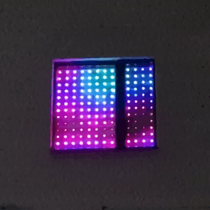

**Новогодняя гирлянда**
=====================

**The christmas lights**
=====================

  

`Описание проекта`
-----------------------------------

**Это моя попытка создать новогоднюю оконную гирлянду на основе светодиодов WS2812B, управляемых с помощью приложения для операционной системы Android (телефоны, планшеты и декстопы). Среда разработки IDE — VS Code + расширение PlatformIO (среда Ардуино для микроконтроллеров ESP).**

**Некоторые эффекты для гирлянды были придуманы и разработаны мной полностью, а также некоторые разработаны мной, но вдохновлены эффектами из других проектов. Также некоторые эффекты взяты мной полностью без изменений или с модификацией/доработкой. Источники:**

* Проекты alexgyver.ru;
* Проекты wokwi.com;
* Примеры из библиотек Adafruit NeoPixel, Adafruit NeoMatrix и FastLED;
* Проекты других авторов, чьи данные, к сожалению, не сохранились.

**Вы можете повторить мой проект и собрать свою собственную новогоднюю гирлянду. 
Андроид-приложение ([скачать из RuStore](https://www.rustore.ru/catalog/app/BARANOV.K.D.LED_Girlianda)) предназначено для управления по сети Wi-Fi микроконтроллером ESP8266, который в свою очередь управляет новогодней гирляндой (матрицей из светодиодов). Доступно 62 различных эффектов, включая красочные радужные переливы, бегущую строку, анимацию, 23 готовых картинки и многое другое. ВНИМАНИЕ: некоторые эффекты запускаются и отключаются с задержкой от 1 до 5 секунд, во избежание зависания не нужно много раз нажимать на включение или отключение режима, но если прошло более 10 секунд, то это неисправность.**

**Почти для всех эффектов достаточно изменить размер матрицы mWidth и mHeight в main.h для корректной работы. Проект создавался и отлаживался на матрице 12х13. Анимации и готовые картинки созданы сугубо под размер 12х13.**

**Гирлянда в виде матрицы из 12х13 светодиодов идеально подойдёт для большинства двустворчатых окон с размером оконного проема 150х150 см (обычно как раз 120 мм в ширину и 130 мм в высоту занимает стеклопакет). Если у вас окно другого размера или вы хотите повесить гирлянду на балкон, вы можете изменить размеры матрицы в исходном коде в соответствии с вашими потребностями.**

  

`Прошивка микроконтроллера`
-----------------------------------

Прошить микроконтроллер, будь это отдельный модуль ***ESP-12E/12F*** в схеме или отладочная плата ***NodeMCU*** на его основе, можно напрямую через VS Code. Для этого необходимо:

1. Подключить ESP к ПК через USB или через USB to TTL CH340 (необходим драйвер для обоих вариантов);
2. Установить из магазина расширений PlatformIO IDE (https://platformio.org);
3. В боковой панели слева выбрать расширение PlatformIO (голова инопланетянина);
4. Выбрать папку TheLights как проект и открыть;
5. Оставаясь в этой вкладке выбрать PROJECT TASKS -> esp12e -> Platform -> (1) Build Filesystem Image и (2) Upload Filesystem Image (это первоначальные настройки гирлянды которые хранятся в data -> config.json)
6. Выполнить сборку (нижняя панель) PlatformIO: Build и загрузить код в микроконтроллер PlatformIO: Upload

После прошивки необходимо перезагрузить модуль ***ESP-12E/12F*** или нажать на кнопку ***RST*** на плате ***NodeMCU***.
 
`Сборка схемы`
-----------------------------------
    
   Соберите [схему](https://github.com/ThyingEquation/The-WI-FI-LIGHTS/blob/main/Гирлянада-Э3.jpg) на основе платы NodeMCU или [схему](https://github.com/ThyingEquation/The-WI-FI-LIGHTS/blob/main/Гирлянада_ESP12EF.pdf) на основе модуля ***ESP-12E/12F***. Для схемы на основе модуля ***ESP-12E/12F*** возможно изготовить [печатную плату](https://github.com/ThyingEquation/The-WI-FI-LIGHTS/blob/main/LUT_board.pdf). Плата специально изготавливалась под ЛУТ для одностороннего стеклотекстолита. ВАЖНО! Прошивать модуль можно и в собранной схеме. В качестве светодиодов только WS2812B, можно купить в виде ленты с шагом 10 см для простоты монтажа на окно.
   
 Технические параметры схемы: 
   + напряжение питания 5 В от блока питания (220 В -> 5 В); (подойдет вообще любой блок питания, главное — не превысить допустимое потребление тока. Лучше всего взять блок с запасом 20% по току)
   + ток потребления схемы (матрица отключена, только отладочная плата NodeMCU) ≈ 0,250 А;
   + ток потребления 156 (12х13) светодиодов белого цвета (самый прожорливый цвет) при обычной яркости (50 из 255 возможных, в прошивке в качестве стандартной) + схема в сборе ≈ 1,110 А;
   + ток потребления 156 (12х13) светодиодов белого цвета при максимальной яркости (255) + схема в сборе ≈ 2,5 А;

`Подключение`
-----------------------------------

После прошивки микроконтроллера при подаче питания будет создана сеть Wi-Fi с автоматически сгенерированным названием (если небыли загружены настройки из файла config.json) сети по типу `ESP-67B17` и паролем `11111111`. 
   Скачайте и установите из RuStore [приложение](https://apps.rustore.ru/app/BARANOV.K.D.LED_Girlianda). Подключитесь к создаваемой гирляндой сети и управляйте различными режимами. Для удобства дальнейшего использования можно настроить имя сети WI-FI во вкладке «НАСТРОЙКИ». После смены имени сети на ваше сеть с новым именем теперь будет запрашивать пароль, тот же пароль, что и был, который равен `11111111` (8 единиц). Настройка завершена. Из приложения пароль изменить невозможно, только через исходный код. 

`Управление гирляндой`
-----------------------------------
   
   Для активации эффекта, необходимо нажать на переключатель и выбранный режим активириуется. Повторное нажатие на этот же переключатель выключит данный режим. Для активации другого эффекта можно нажать сразу на другой переключатель, работающий до этого эффект прекратит работу и запустится новый.
   
   Для включения "Различные картинки", необходимо нажать на изображение требуемой картинки.
   В "Рисовалке" можно попиксельно окрашивать матрицу, для этого необходимо выбрать цвет и нажимать или медленно передвигать по матрице. Цветной квадрат снизу выполняет полную заливку гирлянды, а белый квадрат - полную очистку.

   Для того чтобы при включении автоматически запускался эффект, необходимо около 3х секунд удерживать на названии выбранного эффекта. Стартовым можно сделать любой эффект, кроме всех бегущих строк, "Рисовалки" и "Различных картинок".

   Помимо смены названия, в настройках можно:
   - изменить яркость от 0 до 100%. По умолчанию стоит яркость 20% т.е значение 50 из 255 возможных. Изменение значение яркости может негативно отразиться на эффектах, так как эффекты отлаживались на яркости 20%. Для некоторых эффектов яркость задана константным значением из-за особенностей этих эффектов. !!! УВЕЛИЧЕНИЕ ЯРКОСТИ ПРИВОДИТ К ПОВЫШЕННОМУ ПОТРЕБЛЕНИЮ ТОКА И СИЛЬНОМУ НАГРЕВУ СВЕТОДИОДОВ !!!;
   - изменить порядок следования эффектов для эффекта "Все эффекты. Или подряд или в случайном порядке";
   - изменить длительность эффектов для эффекта "Все эффекты. Длительность задается в секундах от 10 до 3600 секунд;
   - изменить размер матрицы для "Рисовалки";
   - отключить точку доступа Wi-Fi до следующей перезагрузки;
   - автоматически отключать точку доступа Wi-Fi, через 5 минут после включения гирлянды;
   - сбросить стартовый режим.
   
   Возможны зависания (по сети Wi-Fi подключается, но на команды не реагирует), в случае зависания просто перезагрузить. Не оставляйте гирлянду без присмотра, отключайте на ночь.
